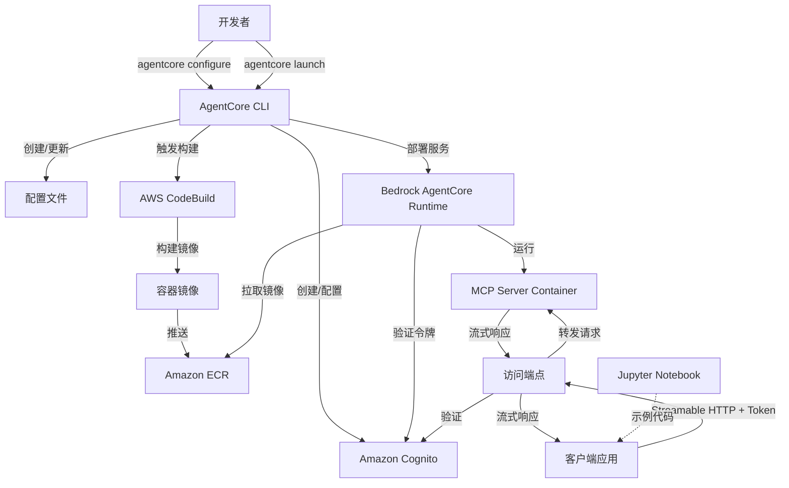
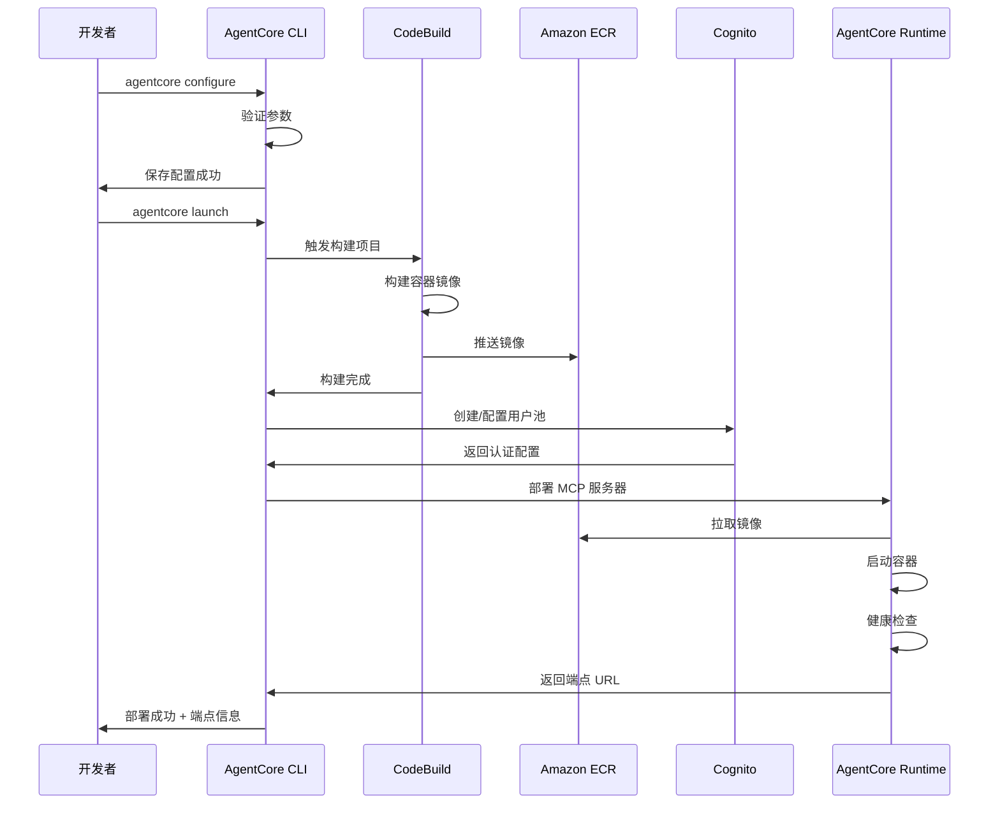
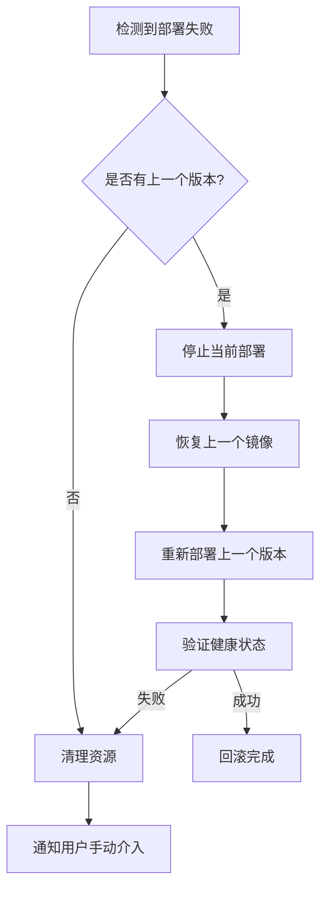

# Design Document

## Overview

本设计文档描述了一个完整的 MCP 服务器部署系统，该系统通过 Amazon Bedrock AgentCore Runtime 将 Excel MCP 服务器部署为托管服务。系统由三个主要组件构成：

1. **AgentCore CLI** - 命令行工具，提供 configure 和 launch 命令
2. **构建和部署管道** - 使用 AWS CodeBuild 和 ECR 构建容器镜像
3. **运行时环境** - Bedrock AgentCore Runtime 托管 MCP 服务器并提供 Streamable HTTP 访问

系统设计遵循基础设施即代码（IaC）原则，自动化所有部署步骤，并集成 Amazon Cognito 提供企业级身份认证。

## Architecture

### 系统架构图



### 部署流程



## Components and Interfaces

### 1. AgentCore CLI

命令行工具是用户与系统交互的主要接口。

#### 命令接口

**configure 命令**
```bash
agentcore configure \
  --server "uvx excel-mcp-server" \
  --transport "streamable-http" \
  --region "us-east-1" \
  --project-name "my-excel-mcp"
```

参数说明：
- `--server`: MCP 服务器启动命令（支持 uvx 格式）
- `--transport`: 传输协议（streamable-http）
- `--region`: AWS 区域
- `--project-name`: 项目名称（用于资源命名）

**launch 命令**
```bash
agentcore launch \
  --config-file "./agentcore-config.json" \
  --verbose
```

参数说明：
- `--config-file`: 配置文件路径（可选，默认使用上次 configure 的配置）
- `--verbose`: 启用详细日志输出

#### 配置文件格式

```json
{
  "version": "1.0",
  "project": {
    "name": "my-excel-mcp",
    "region": "us-east-1"
  },
  "server": {
    "command": "uvx",
    "args": ["excel-mcp-server"],
    "transport": "streamable-http",
    "environment": {}
  },
  "build": {
    "codebuildProject": "agentcore-mcp-builder",
    "ecrRepository": "agentcore/excel-mcp-server"
  },
  "auth": {
    "cognitoUserPoolId": "",
    "cognitoClientId": ""
  }
}
```

#### CLI 核心模块

```typescript
interface AgentCoreCLI {
  // 配置管理
  configure(options: ConfigureOptions): Promise<ConfigResult>
  validateConfig(config: Config): ValidationResult
  saveConfig(config: Config, path: string): Promise<void>
  
  // 部署流程
  launch(options: LaunchOptions): Promise<DeploymentResult>
  
  // 内部方法
  triggerBuild(config: Config): Promise<BuildResult>
  setupAuth(config: Config): Promise<AuthConfig>
  deployToRuntime(config: Config, imageUri: string, authConfig: AuthConfig): Promise<Endpoint>
  
  // 日志和反馈
  logger: Logger
  progressReporter: ProgressReporter
}
```

### 2. 构建管道组件

#### CodeBuild 项目配置

CodeBuild 项目使用以下 buildspec.yml：

```yaml
version: 0.2

phases:
  pre_build:
    commands:
      - echo Logging in to Amazon ECR...
      - aws ecr get-login-password --region $AWS_REGION | docker login --username AWS --password-stdin $ECR_REGISTRY
      
  build:
    commands:
      - echo Building MCP Server container...
      - docker build -t $IMAGE_NAME:$IMAGE_TAG .
      - docker tag $IMAGE_NAME:$IMAGE_TAG $ECR_REGISTRY/$IMAGE_NAME:$IMAGE_TAG
      
  post_build:
    commands:
      - echo Pushing image to ECR...
      - docker push $ECR_REGISTRY/$IMAGE_NAME:$IMAGE_TAG
      - echo Build completed on `date`

artifacts:
  files:
    - imageDetail.json
```

#### Dockerfile 模板

```dockerfile
FROM python:3.11-slim

# 安装 uv 和 uvx
RUN pip install uv

# 设置工作目录
WORKDIR /app

# 安装 MCP 服务器
ARG MCP_SERVER_PACKAGE
RUN uvx install ${MCP_SERVER_PACKAGE}

# 暴露端口
EXPOSE 8080

# 启动命令
CMD ["uvx", "excel-mcp-server", "--transport", "streamable-http", "--port", "8080"]
```

### 3. 身份认证组件

#### Cognito 配置

```typescript
interface CognitoConfig {
  userPool: {
    poolName: string
    policies: PasswordPolicy
    mfaConfiguration: 'OFF' | 'OPTIONAL' | 'ON'
  }
  
  appClient: {
    clientName: string
    generateSecret: boolean
    authFlows: string[]
    tokenValidity: {
      accessToken: number  // 小时
      idToken: number
      refreshToken: number  // 天
    }
  }
}
```

#### 认证流程

客户端获取令牌的流程：

```python
import boto3

# 初始化 Cognito 客户端
cognito = boto3.client('cognito-idp', region_name='us-east-1')

# 用户认证
response = cognito.initiate_auth(
    ClientId='your-client-id',
    AuthFlow='USER_PASSWORD_AUTH',
    AuthParameters={
        'USERNAME': 'user@example.com',
        'PASSWORD': 'password'
    }
)

# 获取访问令牌
access_token = response['AuthenticationResult']['AccessToken']
```

### 4. Bedrock AgentCore Runtime

#### 运行时接口

```typescript
interface AgentCoreRuntime {
  // 部署管理
  deployServer(config: DeploymentConfig): Promise<Deployment>
  updateServer(deploymentId: string, config: DeploymentConfig): Promise<Deployment>
  deleteServer(deploymentId: string): Promise<void>
  
  // 健康检查
  healthCheck(deploymentId: string): Promise<HealthStatus>
  
  // 端点管理
  createEndpoint(deploymentId: string): Promise<Endpoint>
  getEndpoint(deploymentId: string): Promise<Endpoint>
}

interface Deployment {
  id: string
  status: 'CREATING' | 'ACTIVE' | 'FAILED' | 'UPDATING'
  imageUri: string
  authConfig: AuthConfig
  endpoint?: Endpoint
  createdAt: Date
  updatedAt: Date
}

interface Endpoint {
  url: string
  protocol: 'streamable-http'
  authRequired: boolean
}
```

#### Streamable HTTP 处理

运行时实现 Streamable HTTP 协议的请求转发：

```typescript
class StreamableHttpHandler {
  async handleRequest(
    request: IncomingRequest,
    mcpServerUrl: string
  ): Promise<StreamableResponse> {
    // 验证认证令牌
    const token = this.extractToken(request)
    await this.validateToken(token)
    
    // 建立到 MCP 服务器的连接
    const mcpConnection = await this.connectToMCPServer(mcpServerUrl)
    
    // 转发请求并流式传输响应
    return this.streamResponse(request, mcpConnection)
  }
  
  private async streamResponse(
    request: IncomingRequest,
    connection: MCPConnection
  ): Promise<StreamableResponse> {
    const stream = new TransformStream()
    
    // 异步处理流式数据
    this.pipeData(request, connection, stream)
    
    return {
      status: 200,
      headers: {
        'Content-Type': 'application/json',
        'Transfer-Encoding': 'chunked'
      },
      body: stream.readable
    }
  }
}
```

### 5. 客户端 SDK

#### Python 客户端示例

```python
class MCPClient:
    def __init__(self, endpoint_url: str, access_token: str):
        self.endpoint_url = endpoint_url
        self.access_token = access_token
        self.session = requests.Session()
        self.session.headers.update({
            'Authorization': f'Bearer {access_token}',
            'Content-Type': 'application/json'
        })
    
    def send_request(self, method: str, params: dict) -> Iterator[dict]:
        """发送请求并流式接收响应"""
        payload = {
            'jsonrpc': '2.0',
            'method': method,
            'params': params,
            'id': str(uuid.uuid4())
        }
        
        response = self.session.post(
            self.endpoint_url,
            json=payload,
            stream=True
        )
        
        response.raise_for_status()
        
        # 流式解析响应
        for line in response.iter_lines():
            if line:
                yield json.loads(line)
```

## Data Models

### 配置数据模型

```typescript
interface Config {
  version: string
  project: ProjectConfig
  server: ServerConfig
  build: BuildConfig
  auth: AuthConfig
}

interface ProjectConfig {
  name: string
  region: string
  tags?: Record<string, string>
}

interface ServerConfig {
  command: string  // 'uvx'
  args: string[]   // ['excel-mcp-server']
  transport: 'streamable-http'
  environment: Record<string, string>
  port?: number
}

interface BuildConfig {
  codebuildProject: string
  ecrRepository: string
  imageTag?: string
  buildTimeout?: number  // 分钟
}

interface AuthConfig {
  cognitoUserPoolId?: string
  cognitoClientId?: string
  cognitoRegion?: string
}
```

### 部署状态模型

```typescript
interface DeploymentState {
  phase: DeploymentPhase
  status: DeploymentStatus
  progress: number  // 0-100
  message: string
  startTime: Date
  endTime?: Date
  error?: DeploymentError
}

enum DeploymentPhase {
  CONFIGURING = 'configuring',
  BUILDING = 'building',
  AUTHENTICATING = 'authenticating',
  DEPLOYING = 'deploying',
  VERIFYING = 'verifying',
  COMPLETED = 'completed'
}

enum DeploymentStatus {
  IN_PROGRESS = 'in_progress',
  SUCCESS = 'success',
  FAILED = 'failed',
  ROLLED_BACK = 'rolled_back'
}

interface DeploymentError {
  code: string
  message: string
  phase: DeploymentPhase
  suggestion?: string
}
```

### MCP 协议数据模型

```typescript
interface MCPRequest {
  jsonrpc: '2.0'
  method: string
  params?: any
  id: string | number
}

interface MCPResponse {
  jsonrpc: '2.0'
  result?: any
  error?: MCPError
  id: string | number
}

interface MCPError {
  code: number
  message: string
  data?: any
}

interface StreamChunk {
  type: 'data' | 'error' | 'end'
  payload: any
  timestamp: Date
}
```

## Corr
ectness Properties

*A property is a characteristic or behavior that should hold true across all valid executions of a system-essentially, a formal statement about what the system should do. Properties serve as the bridge between human-readable specifications and machine-verifiable correctness guarantees.*

基于需求分析，我们识别出以下核心正确性属性。这些属性将通过属性测试来验证系统行为的正确性。

### 配置管理属性

**Property 1: 配置参数验证完整性**
*For any* 配置参数集合，当执行 configure 命令时，CLI 应该验证所有必需参数的存在性和有效性，并且只有当所有参数都有效时才保存配置
**Validates: Requirements 1.1, 1.5**

**Property 2: 配置持久化往返一致性**
*For any* 有效的配置对象，保存到文件后再读取应该得到等价的配置对象
**Validates: Requirements 1.4**

**Property 3: 源路径验证正确性**
*For any* MCP 服务器源路径，CLI 应该正确识别有效路径（存在且可访问）和无效路径（不存在或不可访问）
**Validates: Requirements 1.2**

**Property 4: AWS 区域验证正确性**
*For any* AWS 区域字符串，CLI 应该正确识别有效区域（在 AWS 支持的区域列表中）和无效区域
**Validates: Requirements 1.3**

### 构建和部署属性

**Property 5: Launch 命令触发构建**
*For any* 有效配置，执行 launch 命令应该触发 CodeBuild 项目，并且可以通过 CodeBuild API 查询到构建任务
**Validates: Requirements 2.1**

**Property 6: 构建镜像包含正确内容**
*For any* 成功构建的容器镜像，镜像应该包含配置中指定的 MCP 服务器包和 uvx 工具
**Validates: Requirements 2.2, 8.2**

**Property 7: 成功构建推送到 ECR**
*For any* 成功的构建，构建的镜像应该出现在配置的 ECR 仓库中，并且可以通过 ECR API 查询到
**Validates: Requirements 2.3**

**Property 8: 构建进度信息输出**
*For any* 构建过程，CLI 的输出应该包含进度相关的信息（如百分比、阶段名称等）
**Validates: Requirements 2.5**

### 身份认证属性

**Property 9: 部署创建 Cognito 资源**
*For any* 部署流程，应该创建或配置 Cognito 用户池和应用客户端，并且可以通过 Cognito API 查询到这些资源
**Validates: Requirements 3.1, 3.2**

**Property 10: 认证信息关联到部署**
*For any* 完成的部署，部署配置应该包含 Cognito 用户池 ID 和客户端 ID
**Validates: Requirements 3.3**

**Property 11: 令牌验证拒绝无效请求**
*For any* 不包含有效 Cognito 令牌的请求，运行时应该拒绝访问并返回 401 状态码
**Validates: Requirements 3.5**

**Property 12: 令牌验证接受有效请求**
*For any* 包含有效 Cognito 令牌的请求，运行时应该验证通过并转发请求到 MCP 服务器
**Validates: Requirements 3.4**

### 部署和端点属性

**Property 13: 前置条件满足触发部署**
*For any* 配置，当容器镜像构建完成且认证配置就绪时，CLI 应该触发部署到 AgentCore Runtime
**Validates: Requirements 4.1**

**Property 14: 部署执行健康检查**
*For any* 部署，运行时应该执行健康检查，并且只有健康检查通过后才创建端点
**Validates: Requirements 4.2, 4.3**

**Property 15: 成功部署返回端点信息**
*For any* 成功的部署，CLI 应该返回包含端点 URL 和认证信息的结果
**Validates: Requirements 4.4**

### Streamable HTTP 传输属性

**Property 16: 认证请求正确转发**
*For any* 带有有效令牌的客户端请求，运行时应该通过 Streamable HTTP 协议转发请求到 MCP 服务器
**Validates: Requirements 5.1**

**Property 17: 响应流式传输**
*For any* MCP 服务器响应，运行时应该以流式方式（chunked transfer）传输响应到客户端
**Validates: Requirements 5.2**

**Property 18: 连接保持支持双向通信**
*For any* 建立的客户端连接，运行时应该保持连接活跃，支持多个请求/响应往返
**Validates: Requirements 5.3**

**Property 19: 传输错误返回明确信息**
*For any* 传输过程中的错误，运行时应该返回包含错误代码和描述的响应
**Validates: Requirements 5.4**

### 日志和反馈属性

**Property 20: 命令执行显示进度**
*For any* CLI 命令执行，输出应该包含进度指示器（如进度条、百分比或阶段信息）
**Validates: Requirements 7.1**

**Property 21: 成功步骤输出资源信息**
*For any* 成功完成的关键步骤，CLI 输出应该包含相关资源的标识信息（如 ID、ARN 或 URL）
**Validates: Requirements 7.2**

**Property 22: 错误输出包含原因和建议**
*For any* 错误情况，CLI 输出应该包含错误原因和至少一条解决建议
**Validates: Requirements 7.3**

**Property 23: 详细模式输出调试信息**
*For any* 启用详细日志模式的命令执行，输出应该包含比正常模式更多的调试信息
**Validates: Requirements 7.4**

**Property 24: 部署完成输出摘要**
*For any* 完成的部署，CLI 输出应该包含端点 URL 和后续步骤指引
**Validates: Requirements 7.5**

### uvx 命令处理属性

**Property 25: uvx 命令解析正确性**
*For any* uvx 格式的命令字符串，CLI 应该正确提取包名、版本和参数
**Validates: Requirements 8.1**

**Property 26: 容器包含 uvx 和 MCP 包**
*For any* 构建的容器镜像，镜像应该包含 uvx 工具和配置中指定的 MCP 服务器包
**Validates: Requirements 8.2**

**Property 27: 容器使用 uvx 启动服务器**
*For any* 启动的容器，容器进程应该使用 uvx 命令启动 MCP 服务器
**Validates: Requirements 8.3**

**Property 28: 环境变量正确传递**
*For any* 配置中的环境变量，这些变量应该在容器运行时环境中可用
**Validates: Requirements 8.4**

**Property 29: 版本更新支持重新部署**
*For any* MCP 服务器包的版本更新，系统应该支持使用新版本重新部署，并且新部署使用更新后的版本
**Validates: Requirements 8.5**

## Error Handling

### 错误分类

系统定义以下错误类别：

1. **配置错误** (CONFIG_ERROR)
   - 缺失必需参数
   - 参数格式无效
   - 路径不存在
   - 区域不支持

2. **构建错误** (BUILD_ERROR)
   - CodeBuild 项目不存在
   - 构建超时
   - 镜像推送失败
   - Dockerfile 语法错误

3. **认证错误** (AUTH_ERROR)
   - Cognito 用户池创建失败
   - 令牌无效或过期
   - 权限不足

4. **部署错误** (DEPLOYMENT_ERROR)
   - 运行时环境不可用
   - 健康检查失败
   - 端点创建失败
   - 资源配额超限

5. **运行时错误** (RUNTIME_ERROR)
   - MCP 服务器崩溃
   - 连接超时
   - 流式传输中断
   - 背压处理失败

### 错误处理策略

```typescript
interface ErrorHandler {
  // 错误分类
  classifyError(error: Error): ErrorCategory
  
  // 错误恢复
  attemptRecovery(error: CategorizedError): Promise<RecoveryResult>
  
  // 回滚机制
  rollback(deploymentState: DeploymentState): Promise<void>
  
  // 用户通知
  formatErrorMessage(error: CategorizedError): UserMessage
}

interface RecoveryStrategy {
  // 配置错误：提示用户修正
  CONFIG_ERROR: () => PromptUserCorrection
  
  // 构建错误：重试或清理缓存
  BUILD_ERROR: () => RetryWithCleanCache
  
  // 认证错误：刷新令牌或重新认证
  AUTH_ERROR: () => RefreshOrReauthenticate
  
  // 部署错误：回滚到上一个稳定版本
  DEPLOYMENT_ERROR: () => RollbackToPrevious
  
  // 运行时错误：重启服务或降级
  RUNTIME_ERROR: () => RestartOrDegrade
}
```

### 回滚机制

部署失败时的回滚流程：



### 错误消息格式

```typescript
interface UserMessage {
  level: 'error' | 'warning' | 'info'
  code: string
  message: string
  details?: string
  suggestions: string[]
  documentation?: string
}

// 示例
const configErrorMessage: UserMessage = {
  level: 'error',
  code: 'CONFIG_001',
  message: '配置参数验证失败',
  details: 'AWS 区域 "us-invalid-1" 不是有效的区域代码',
  suggestions: [
    '请使用有效的 AWS 区域代码，如 us-east-1, us-west-2',
    '运行 "aws ec2 describe-regions" 查看可用区域列表'
  ],
  documentation: 'https://docs.aws.amazon.com/general/latest/gr/rande.html'
}
```

## Testing Strategy

本项目采用双重测试策略，结合单元测试和基于属性的测试（Property-Based Testing, PBT）来确保系统的正确性和健壮性。

### 测试框架选择

- **单元测试框架**: Jest (TypeScript/JavaScript)
- **属性测试框架**: fast-check (TypeScript/JavaScript)
- **集成测试**: AWS SDK Mocks + Testcontainers

### 单元测试策略

单元测试专注于验证特定的示例、边界情况和集成点：

1. **配置解析测试**
   - 测试标准配置格式的解析
   - 测试边界情况（空配置、最小配置、最大配置）
   - 测试错误配置的拒绝

2. **命令行接口测试**
   - 测试命令参数解析
   - 测试帮助信息显示
   - 测试错误消息格式

3. **AWS 服务集成测试**
   - 使用 AWS SDK Mocks 模拟服务调用
   - 测试 API 调用的正确参数
   - 测试错误响应的处理

4. **Streamable HTTP 处理测试**
   - 测试流式数据的正确传输
   - 测试连接中断的处理
   - 测试背压机制

### 属性测试策略

属性测试验证系统在各种输入下的通用行为：

**配置要求**:
- 每个属性测试至少运行 100 次迭代
- 使用 fast-check 库生成随机测试数据
- 每个测试必须标注对应的设计文档属性编号

**测试标注格式**:
```typescript
// **Feature: excel-mcp-agentcore-deployment, Property 2: 配置持久化往返一致性**
test('config round-trip consistency', () => {
  fc.assert(
    fc.property(configArbitrary, (config) => {
      const saved = saveConfig(config)
      const loaded = loadConfig(saved)
      expect(loaded).toEqual(config)
    }),
    { numRuns: 100 }
  )
})
```

**属性测试覆盖**:

1. **Property 1-4: 配置管理**
   - 生成随机配置对象
   - 验证验证逻辑的正确性
   - 测试往返一致性

2. **Property 5-8: 构建流程**
   - 生成随机构建配置
   - 验证构建触发和状态跟踪
   - 测试镜像内容验证

3. **Property 9-12: 身份认证**
   - 生成随机令牌（有效和无效）
   - 验证认证逻辑
   - 测试访问控制

4. **Property 13-15: 部署流程**
   - 生成随机部署配置
   - 验证部署条件和状态转换
   - 测试端点创建

5. **Property 16-19: Streamable HTTP**
   - 生成随机请求和响应
   - 验证流式传输行为
   - 测试错误处理

6. **Property 20-24: 日志反馈**
   - 验证输出格式
   - 测试日志级别
   - 验证信息完整性

7. **Property 25-29: uvx 命令处理**
   - 生成随机 uvx 命令字符串
   - 验证解析正确性
   - 测试环境变量传递

### 测试数据生成器

使用 fast-check 定义自定义生成器：

```typescript
// 配置生成器
const configArbitrary = fc.record({
  version: fc.constant('1.0'),
  project: fc.record({
    name: fc.stringOf(fc.char(), { minLength: 1, maxLength: 50 }),
    region: fc.oneof(
      fc.constant('us-east-1'),
      fc.constant('us-west-2'),
      fc.constant('eu-west-1'),
      fc.string() // 包含无效区域
    )
  }),
  server: fc.record({
    command: fc.constant('uvx'),
    args: fc.array(fc.string(), { minLength: 1, maxLength: 5 }),
    transport: fc.constant('streamable-http'),
    environment: fc.dictionary(fc.string(), fc.string())
  })
})

// uvx 命令生成器
const uvxCommandArbitrary = fc.tuple(
  fc.constant('uvx'),
  fc.stringOf(fc.char(), { minLength: 1 }), // 包名
  fc.option(fc.stringOf(fc.char()), { nil: undefined }) // 可选版本
).map(([cmd, pkg, version]) => 
  version ? `${cmd} ${pkg}@${version}` : `${cmd} ${pkg}`
)

// Cognito 令牌生成器
const tokenArbitrary = fc.oneof(
  fc.string().map(s => `Bearer ${s}`), // 随机令牌
  fc.constant(''), // 空令牌
  fc.constant('InvalidFormat'), // 无效格式
  validTokenArbitrary // 有效令牌
)
```

### 集成测试

使用 Testcontainers 进行端到端测试：

```typescript
describe('End-to-End Deployment', () => {
  let localstackContainer: StartedTestContainer
  
  beforeAll(async () => {
    // 启动 LocalStack 容器模拟 AWS 服务
    localstackContainer = await new GenericContainer('localstack/localstack')
      .withExposedPorts(4566)
      .start()
  })
  
  test('complete deployment workflow', async () => {
    // 1. 配置
    const config = await cli.configure({
      server: 'uvx excel-mcp-server',
      region: 'us-east-1'
    })
    
    // 2. 启动部署
    const deployment = await cli.launch(config)
    
    // 3. 验证端点
    expect(deployment.endpoint).toBeDefined()
    
    // 4. 测试访问
    const client = new MCPClient(deployment.endpoint, deployment.token)
    const response = await client.sendRequest('test', {})
    expect(response).toBeDefined()
  })
})
```

### 测试覆盖率目标

- 代码覆盖率: ≥ 80%
- 属性测试覆盖: 所有 29 个属性
- 集成测试: 覆盖主要用户流程
- 错误场景测试: 覆盖所有错误类别

### 持续集成

测试在 CI/CD 管道中自动运行：

```yaml
# .github/workflows/test.yml
name: Test

on: [push, pull_request]

jobs:
  test:
    runs-on: ubuntu-latest
    steps:
      - uses: actions/checkout@v2
      - uses: actions/setup-node@v2
      - run: npm install
      - run: npm run test:unit
      - run: npm run test:property
      - run: npm run test:integration
      - run: npm run coverage
```

## Implementation Notes

### 技术栈

- **CLI 工具**: TypeScript + Commander.js
- **AWS SDK**: AWS SDK for JavaScript v3
- **容器化**: Docker + Docker Compose
- **测试**: Jest + fast-check + Testcontainers
- **文档**: Jupyter Notebook + Markdown

### 依赖项

```json
{
  "dependencies": {
    "@aws-sdk/client-codebuild": "^3.0.0",
    "@aws-sdk/client-ecr": "^3.0.0",
    "@aws-sdk/client-cognito-identity-provider": "^3.0.0",
    "@aws-sdk/client-bedrock-agent-runtime": "^3.0.0",
    "commander": "^11.0.0",
    "chalk": "^5.0.0",
    "ora": "^6.0.0"
  },
  "devDependencies": {
    "@types/jest": "^29.0.0",
    "jest": "^29.0.0",
    "fast-check": "^3.0.0",
    "testcontainers": "^10.0.0",
    "typescript": "^5.0.0"
  }
}
```

### 部署架构决策

1. **使用 CodeBuild 而非本地构建**
   - 理由: 提供一致的构建环境，避免本地环境差异
   - 权衡: 增加构建时间，但提高可靠性

2. **使用 Cognito 而非自定义认证**
   - 理由: 企业级安全性，支持多种认证流程
   - 权衡: 增加 AWS 服务依赖，但减少安全风险

3. **使用 Streamable HTTP 而非 WebSocket**
   - 理由: 更好的 HTTP 基础设施兼容性
   - 权衡: 可能不如 WebSocket 高效，但更易部署

4. **使用 uvx 而非直接 pip install**
   - 理由: 隔离依赖，避免版本冲突
   - 权衡: 增加启动时间，但提高稳定性

### 性能考虑

- **构建缓存**: 使用 Docker 层缓存加速构建
- **连接池**: 复用 AWS SDK 客户端连接
- **流式传输**: 使用 chunked transfer 减少内存占用
- **健康检查**: 使用轻量级探针减少开销

### 安全考虑

- **最小权限原则**: IAM 角色仅授予必需权限
- **令牌过期**: Cognito 令牌设置合理的过期时间
- **HTTPS 强制**: 所有端点强制使用 HTTPS
- **日志脱敏**: 避免在日志中记录敏感信息

## Future Enhancements

1. **多区域部署支持**
   - 支持跨区域复制和故障转移

2. **自动扩缩容**
   - 基于负载自动调整容器实例数量

3. **监控和告警**
   - 集成 CloudWatch 提供实时监控
   - 配置告警规则

4. **版本管理**
   - 支持蓝绿部署
   - 支持金丝雀发布

5. **成本优化**
   - 使用 Spot 实例降低成本
   - 实现智能资源调度
